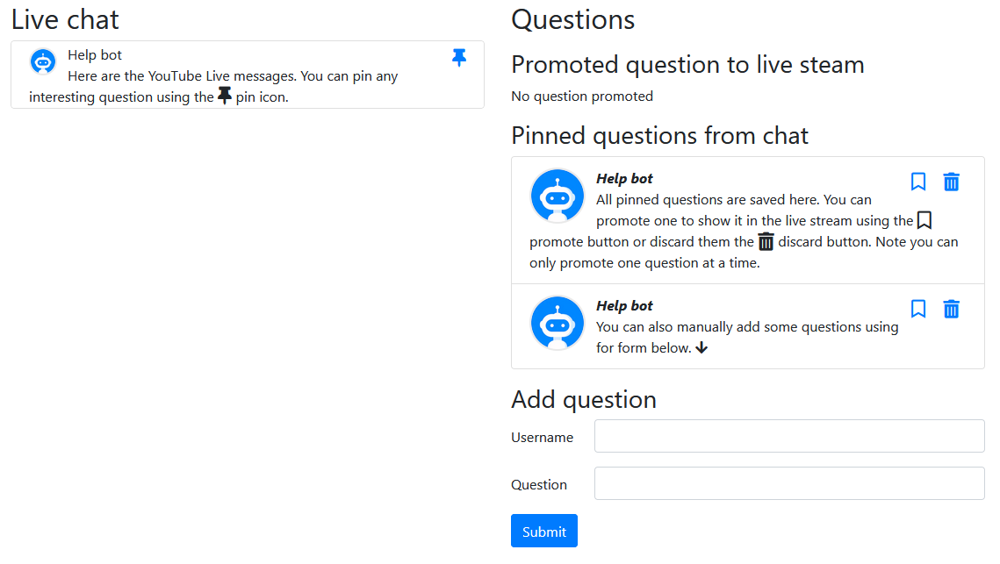
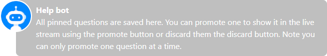

# Youtube Live Stream Question

This project is a Java application that fetch YouTube live and Twitch chat comments to display some in your live stream.

## Features

* Display chat comments
* Pin a comment as a question
* Promote a question to the live
* Demote the live question
* Unpin a question

## Usage

The moderation team can select questions from chat and promote them to live stream:



In the same time, the overlay will update to display the promoted question:



## Running the application in dev mode

You can run your application in dev mode that enables live coding using:
```
./mvnw quarkus:dev
```

## Packaging and running the application

The application can be packaged using `./mvnw package`.
It produces the `youtube-live-question-1.0.0-runner.jar` file in the `/target` directory.
Be aware that it’s not an _über-jar_ as the dependencies are copied into the `target/lib` directory.

The application is now runnable using `java -jar target/youtube-live-question-1.0.0-runner.jar`.
